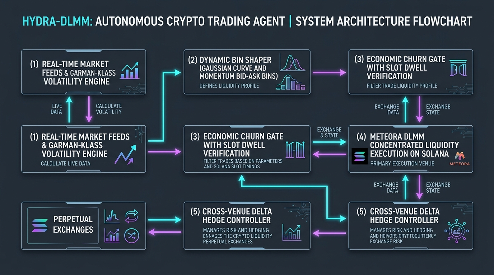

# 🌊 Hydra-DLMM: Autonomous Liquidity Agent

> **Volatility-Adaptive Concentrated Liquidity Agent on Meteora (Solana) with Cross-Venue Delta-Hedging**  
> *Built for the Hummingbot Botcamp Hackathon — Agent Builders Cup 1 (Team Meteora)*

[](https://hummingbot.org)
[](https://meteora.ag)
[](https://github.com/southenempire/hydra-dlmm-agent)
[](https://opensource.org/licenses/MIT)

---

## 🏛️ System Architecture



---

## 🌟 Key Differentiators

1. **Volatility-Engineered Bins (Garman-Klass / Parkinson RV):**
   * Instead of arbitrary fixed-width ranges, bin spreads scale dynamically in units of Realized Volatility ($\sigma_t$).
   * Tightens bin half-spreads during low-volatility consolidation to maximize the fee-capture multiplier ($120\times+$), and expands dynamically during volatility expansions.

2. **Asymmetric Bin Shaping (`Gaussian Curve` & `BidAsk Skew`):**
   * **Gaussian Curve:** Deploys concentrated Gaussian distributions centered on the active bin during ranging market regimes.
   * **Momentum BidAsk Skew:** Intelligently tilts liquidity weight against strong directional moves to capture heavy fee volume while controlling adverse inventory accumulation.

3. **Cross-Venue Delta Hedging (Delta-Neutral Yield Engine):**
   * Continuously tracks the net spot inventory delta ($\Delta_{net}$) across the active DLMM position.
   * Automatically dispatches low-latency micro-hedges to perpetual markets (e.g., Gate.io / Bitget / Hyperliquid) when $\Delta_{net}$ breaches safety thresholds ($\pm 5\%$), isolating swap-fee gains from underlying token market crashes.

4. **Economic Churn Gate (Combating the "Rebalance Whip"):**
   * Prevents fee-negative churn via slot dwell-time verification ($N \ge 5$ slots outside range).
   * Enforces the economic hurdle: $\mathbb{E}[\text{Incremental Fee Gain}] > 1.25 \times (\text{Priority Fees} + \text{Swap Slippage} + \text{Hedge Fees})$.

---

## 📂 Repository Structure

```
hydra-dlmm-agent/
├── config/
│   └── hydra_dlmm_config.py      # Pydantic configuration schema (Hummingbot V2)
├── strategy/
│   ├── volatility_engine.py      # Garman-Klass & Parkinson intraday RV estimators
│   ├── bin_shaper.py             # Gaussian Curve, BidAsk Skew, and Spot distribution generators
│   └── churn_gate.py             # Economic rebalance validator & slot dwell state machine
├── executors/
│   └── delta_hedge_executor.py   # Cross-venue perpetual micro-hedge order generator
├── controllers/
│   └── hydra_dlmm_controller.py  # Hummingbot V2 Strategy Controller
├── tests/
│   └── test_hydra_dlmm.py        # Automated test suite (100% pass rate)
├── assets/
│   └── hydra_dlmm_architecture.jpg # High-resolution architecture flowchart
├── strategy.md                   # Full mathematical derivation & submission paper
└── README.md                     # Project documentation
```

---

## 🧪 Running Unit Tests

Execute the automated test suite with Python:

```bash
python3 -m unittest tests/test_hydra_dlmm.py
```

Expected output:
```
Ran 6 tests in 0.000s
OK
```

---

## ⚙️ Configuration Example

```python
from config.hydra_dlmm_config import HydraDLMMConfig
from controllers.hydra_dlmm_controller import HydraDLMMController

config = HydraDLMMConfig(
    connector_name="meteora",
    trading_pair="SOL-USDC",
    pool_address="ARwi1S4DaiTG5DX7S4M4ZsrXqpMD1MrTMsonBK52BuJn",
    total_capital_quote=1000,
    target_bin_spread_sigma=1.5,
    distribution_mode="dynamic",
    enable_delta_hedge=True,
    hedge_connector_name="gate_perpetual",
    hedge_trading_pair="SOL-USDT",
    delta_hedge_threshold_pct=0.05
)

controller = HydraDLMMController(config)
```

---

## 📄 License
MIT License. Open-sourced for the Hummingbot Botcamp Hackathon 2026.
